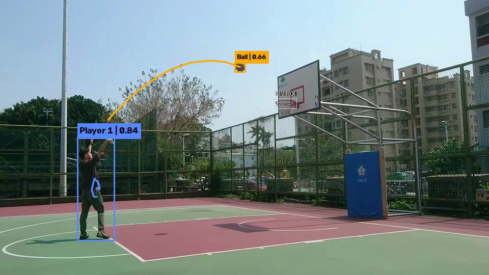
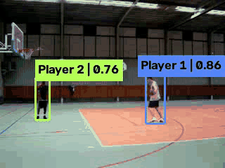
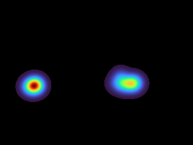

# CourtVision AI

An AI-powered basketball video analytics project built with deep learning and computer vision.

This repository is being developed incrementally. **V2 — Basketball Event Analytics** adds a pretrained sports-ball baseline, a primary ball trail, possession proxies, and conservative shot candidates around a manually selected rim. V0 detection and V1 ByteTrack IDs, trajectories, motion summaries, and heatmaps remain available.

## V2 Demo



The public 960×540 sample runs on CPU with default `yolo26n.pt` weights. It preserves **101 frames at 30 FPS**, keeps player ID **1**, selects visible ball candidates in **40 frames (39.6%)**, and confirms a possession proxy in **6 frames**. The longest continuous ball history contains **27 observations**. This selected frame shows an actual ball trajectory; these counts are observations, not accuracy measurements.

[Analytics JSON](docs/assets/v2-analytics.json) · [Movement heatmap](docs/assets/v2-heatmap.png) · [Validation record](docs/assets/v2-validation.json)

**Real-video shot recognition remains unvalidated.** The clip contains a shot, but missing ball observations interrupt the required approach evidence, so this run reports zero shot-attempt candidates. Synthetic trajectories verify made, missed, and unknown rule outcomes; they do not establish real-video event accuracy. Sample footage: [chonyy/AI-basketball-analysis](https://github.com/chonyy/AI-basketball-analysis/tree/master/static/uploads).

## V1 Demo

**Player ID → Bounding Box → Trajectory**, with a movement heatmap and per-track JSON analytics.

| Tracking preview | Movement heatmap |
| --- | --- |
|  |  |

The public basketball sample keeps ByteTrack IDs **1** and **2** across all **141 frames**, at **320 × 240** and **29.97 FPS**, using CPU inference. The GIF is a lightweight preview sampled at approximately 6 FPS; the annotated MP4 preserves the source FPS. The heatmap represents activity in image coordinates.

[View the generated JSON analytics](docs/assets/v1-analytics.json), including frames seen, cumulative pixel displacement, average/max pixel speed, and normalized displacement for each ID. Distance is measured in **pixels** and speed in **px/s**; court calibration is required for physical measurements.

## Roadmap

- [x] V0 — Player Detection
- [x] V1 — Player Tracking & Motion Analytics
- [x] V2 — Basketball Event Analytics
- [ ] V3 — Custom Model Fine-Tuning
- [ ] V4 — Pose & Advanced Analytics

## Features

- Reads local video sequentially with OpenCV and loads pretrained COCO YOLO weights once.
- Filters people and sports-ball candidates with separate configurable confidence thresholds.
- Preserves the source resolution and FPS in an annotated MP4.
- Selects CUDA when available, otherwise CPU, and prints progress.
- Validates inputs, creates output directories, and releases video resources after errors.

### V1 Features

- Uses the official Ultralytics ByteTrack implementation and `bytetrack.yaml` defaults.
- Displays temporary persistent track IDs and confidence scores.
- Draws bounded trajectories with deterministic colors for each ID.
- Reports cumulative pixel displacement and speed in **px/s**, with optional speed labels.
- Saves per-track JSON analytics and a PNG movement heatmap automatically.
- Handles missing IDs, gaps, and videos with no visible people.

### V2 Features

- One YOLO inference per frame for `person` and generic COCO `sports ball`.
- A dedicated primary ball matcher with motion continuity, separate ball IDs, and bounded trails.
- Ball boxes, confidence labels, and amber trajectories; no predicted boxes during gaps.
- Temporally confirmed player–ball proximity, exported as `possession_proxy`.
- Optional manual rim ROI; the rest of the pipeline works without it.
- Release, upward motion, and rim approach evidence for shot-attempt candidates.
- Made/missed candidates only with sequential visible evidence; unresolved attempts remain `unknown`.
- FPS-based event timestamps, short readable overlays, and extended JSON analytics.

## V2 Architecture

Basketball Video → OpenCV → YOLO → Person + Sports Ball Detection → Player Tracking + Ball Tracking → Interaction Analysis → Shot Candidate State Machine → Event Timeline → Annotated MP4 + JSON + Heatmap

| Module | V2 responsibility |
| --- | --- |
| `detector.py` | Resolve the sports-ball class from model names; split one prediction into weak person boxes and filtered ball candidates. |
| `tracker.py` | Feed precomputed person boxes to official ByteTrack, preserving V1 weak-detection association. |
| `ball_tracker.py` | Select a primary visible ball using geometry, confidence, and motion continuity; retain bounded history. |
| `interaction.py` | Normalize distance to player rectangles, confirm proximity, handle overlaps, and apply hysteresis. |
| `events.py` | Validate manual ROI, reason over temporal evidence, attribute candidates, and record uncertainty. |
| `analytics.py` | Keep V1 motion fields and add visible-ball, proxy, event, and throughput summaries. |
| `video_processor.py` | Reset state for each video, coordinate one inference, annotate, and safely publish all outputs. |

The CLI enables V2. Existing Python APIs keep their earlier behavior: `PlayerDetector.detect(frame)` detects people, `PlayerTracker.track(frame)` runs V1 person tracking, and `VideoProcessor(detector, tracker)` runs V1 without basketball analysis. Use `enable_basketball=True` to enable V2 through Python. The new `track_detections()` method avoids a second inference call.

## V1 Architecture

Basketball Video → OpenCV → YOLO → Person Detection → ByteTrack → Persistent IDs → Track History → Motion Analytics → Heatmap → Annotated Video

| Module | Responsibility |
| --- | --- |
| `detector.py` | Load YOLO, select the device, and retain the V0 person detection API. |
| `tracker.py` | Run person inference and pass boxes to the official ByteTrack implementation; extract valid IDs and centers. |
| `track_history.py` | Store a bounded deque of recent centers for each ID; expire stale trails. |
| `analytics.py` | Calculate pixel movement and speed, and export running summaries as JSON. |
| `heatmap.py` | Accumulate center visits in a fixed image grid and export a colored PNG. |
| `utils.py` | Validate paths and draw boxes, labels, and trails. |
| `video_processor.py` | Read frames, coordinate the modules, and write the outputs. |
| `main.py` | Parse CLI options, report progress, and handle normal user errors. |

The original `VideoProcessor(detector)` detection-only API also remains available. Existing CLI arguments continue to work, now with ball and interaction analysis enabled by default.

## Installation

Use Python 3.11 or newer. From the `courtvision-ai` directory:

```bash
python3 -m venv .venv
source .venv/bin/activate        # Windows: .venv\Scripts\activate
python -m pip install --upgrade pip
python -m pip install -r requirements.txt
```

Ultralytics installs PyTorch as a dependency. `lap` supplies the assignment solver used by ByteTrack and is installed explicitly to avoid a surprise installation during tracking. If you need a particular CUDA build, install PyTorch first using the [official PyTorch instructions](https://pytorch.org/get-started/locally/), then install this project's requirements.

The first run downloads the small pretrained `yolo26n.pt` weights unless they are already available locally. No training or fine-tuning occurs.

## Usage

Place your basketball video at `data/input/basketball.mp4`. Run:

```bash
python main.py --input data/input/basketball.mp4 --output data/output/basketball_v2.mp4
```

This creates:

```text
data/output/basketball_v2.mp4
data/output/basketball_v2_tracking.json
data/output/basketball_v2_heatmap.png
```

Without a rim ROI, players, the ball, and possession proxies still run; shot analysis is disabled. Add a rim rectangle for your own video:

```bash
python main.py \
  --input data/input/basketball.mp4 \
  --output data/output/basketball_v2.mp4 \
  --confidence 0.5 \
  --model yolo26n.pt \
  --tracker bytetrack.yaml \
  --trajectory-length 40 \
  --ball-confidence 0.25 \
  --rim-roi 145,40,190,75 \
  --possession-distance-threshold 0.4 \
  --possession-min-frames 3 \
  --show-speed \
  --show-events \
  --analytics-output data/output/basketball_tracking.json \
  --heatmap-output data/output/basketball_heatmap.png
```

The ROI above is illustrative: replace it with your video's rim coordinates. `--confidence` filters player outputs; `--ball-confidence` filters sports-ball candidates. The default proximity threshold is a fraction of the player box diagonal, not pixels. `--show-events` displays both proxy indicators and event labels; analytics are exported regardless of this flag. `--model` accepts supported COCO detection checkpoints, including larger models such as `yolo26s.pt`.

### Run the V2 public sample

From the project directory with your virtual environment active:

```bash
curl --fail --location --output data/input/basketball_v2_sample.mp4 https://raw.githubusercontent.com/chonyy/AI-basketball-analysis/master/static/uploads/sample_video.mp4

python main.py \
  --input data/input/basketball_v2_sample.mp4 \
  --output data/output/basketball_v2_sample_annotated.mp4 \
  --rim-roi 540,193,582,213 \
  --show-events
```

Open the resulting MP4 in a local player. The sidecars use `_tracking.json` and `_heatmap.png`. To run without a rim:

```bash
python main.py --input data/input/basketball_v2_sample.mp4 --output data/output/basketball_v2_no_rim.mp4 --show-events
```

### Choose a manual rim ROI

Pause the source at a clear frame. Measure a tight rectangle around the rim opening using an image editor's pixel coordinates: `x1,y1,x2,y2`. The origin is top-left; x grows right and y grows down. The four coordinates must be integers, ordered correctly, and inside the source dimensions. The sample's coordinates are for its 960×540 resolution only.

The ROI is drawn as a subtle gray box. V2 has no trained hoop detector. A single fixed ROI is most useful for a stationary camera; moving cameras, zooms, and cuts invalidate it. Do not reuse the sample coordinates for a different video.

### Verified V2 result

| Property | Source | Annotated output | Output without ROI |
| --- | --- | --- | --- |
| Resolution | 960×540 | 960×540 | 960×540 |
| FPS | 30.0 | 30.0 | 30.0 |
| Fully decoded frames | 101 | 101 | 101 |

Both real runs use default thresholds on CPU. ID 1 is present in every frame, ball candidates appear in 40 frames, and proximity is confirmed in 6 frames. Boxes, actual ball trails, proxy labels, rim ROI, and the heatmap were inspected visually. The recorded ROI run took **2.47 seconds**, approximately **40.94 processing FPS** on this machine. Repeats after the passage and gate changes took 2.38-5.59 seconds (18.08-42.43 processing FPS) and produced the same 40/101 ball frames, 1 player track, 3 ball segments and 0 attempts, with `basketball` keys identical to the version before the trace was added. Throughput includes video reading, inference, tracking, annotation, and encoder close; it excludes model loading and sidecar publication. Results vary with hardware and load.

`source_fps` controls playback and event timing. `processing_fps = frames_processed / processing_seconds` describes processing throughput. They are separate quantities.

The older 320×240 UCF101 clip remains a V1 regression sample. With default YOLO26n and a 0.25 ball threshold, it produces zero ball detections. Lowering the threshold to 0.05 with YOLO11n produced background/shoe false positives as well as a few ball observations. It is unsuitable evidence of reliable ball or shot recognition.

Use `python main.py --help` for all options. A custom `--tracker` path must point to a local YAML file whose `tracker_type` is `bytetrack`. Start with the packaged defaults.

Output directories are created automatically. Video, analytics, and heatmap paths must be distinct and end in `.mp4`, `.json`, and `.png` respectively. Processing can be slower than playback; the saved video still uses the source FPS.

Files are staged before publication. Processing or export failures remove temporary files and preserve existing outputs. If a final rename fails, the processor attempts to restore the previous output set. Filesystem failures that prevent restoration report the location of recoverable backups. If deleting an old backup fails after successful publication, processing remains successful and a warning identifies the leftover backup; other backups are still cleaned up. Publishing three files is not a single atomic filesystem operation, and a power loss during publication cannot be rolled back automatically.

### Run the public basketball demo

The demo uses `v_Basketball_g01_c01.avi` from [tiny-ucf101](https://github.com/bryanyzhu/tiny-ucf101), the clip used in the [GluonCV UCF101 tutorial](https://cv.gluon.ai/build/examples_action_recognition/demo_tsn_ucf101.html). Videos, generated outputs, and model weights are excluded from Git.

On macOS or Linux, download the sample if it is not already present:

```bash
curl --fail --location --output data/input/basketball_sample.avi https://raw.githubusercontent.com/bryanyzhu/tiny-ucf101/master/v_Basketball_g01_c01.avi
```

Run the V1 acceptance command:

```bash
python main.py --input data/input/basketball_sample.avi --output data/output/basketball_sample_tracked.mp4
```

Open `data/output/basketball_sample_tracked.mp4` in your video player. The corresponding files are `basketball_sample_tracked_tracking.json` and `basketball_sample_tracked_heatmap.png` in the same folder. Try your own game footage next with different input and output paths.

### Verified V1 Result

The full public sample was processed on **CPU** with `yolo26n.pt`. Every output frame was decoded, and an annotated frame and the heatmap were inspected visually.

| Property | Input | Output |
| --- | --- | --- |
| Resolution | 320 × 240 | 320 × 240 |
| FPS | 29.97003 | 29.97000 |
| Decoded frames | 141 | 141 |

Both track IDs, `1` and `2`, appeared in all 141 frames. There were 280 trajectory drawing calls after the first observations. The JSON contains two valid track summaries, and the heatmap is a readable 320×240 PNG with activity around the observed centers.

The small FPS difference comes from codec rounding. This short clip verifies the pipeline; it is not a tracking accuracy benchmark or a count of players in a full game.

Validated environment: Python 3.13, Ultralytics 8.4.160, PyTorch 2.14.0, OpenCV 5.0.0, NumPy 2.5.3, and LAP 0.5.13. CUDA selection remains covered by unit tests; actual GPU inference has not been tested on this Mac.

## Understanding ByteTrack

YOLO answers **“Where are the people in this frame?”** It predicts a box, class, and confidence score from the image. COCO class `0` is `person` for the supplied detection weights; model loading checks that mapping.

ByteTrack answers **“Which detections likely belong to the same person across frames?”** It predicts track motion with a Kalman filter and associates boxes between frames. It first matches stronger detections, then uses weaker detections to recover existing tracks. An ID such as `7` is a temporary tracker identity within one video, not a name, jersey number, or biological identity. Occlusion, missed detections, overlapping people, and large movement can cause an ID switch or a new ID.

`PlayerTracker` uses Ultralytics' documented `BYTETracker` directly, with its packaged configuration. This keeps tracker state separate from YOLO and the V0 detection API. In V1, `track()` requests only people. In V2, `detect_scene()` calls `model.predict()` once per frame inside `torch.inference_mode()`, requesting people and sports balls, and `track_detections()` associates the separated person boxes. The inference threshold is the lowest of the player display threshold, ByteTrack's low threshold, and the ball threshold. Weak people reach association; the user player threshold is applied after tracking. Ball confidence is filtered separately.

ByteTrack may need another frame to confirm a newly appearing person. Untracked boxes or invalid IDs are skipped. Empty detection frames still update ByteTrack, allowing lost tracks to age out. A fresh tracker is created for each video; ID numbers can start at `1` again in another video.

## Motion Analytics

Boxes use `[x1, y1, x2, y2]` image pixel coordinates: top-left followed by bottom-right. The tracked position is the **bounding-box center**:

```text
cx = (x1 + x2) / 2
cy = (y1 + y2) / 2
```

Float centers are retained for calculations before box coordinates are converted to integers for drawing. For consecutive observations of the same ID:

```text
displacement_px = sqrt((cx2 - cx1)^2 + (cy2 - cy1)^2)
speed_px_per_second = displacement_px * video_fps
```

For example, movement of 3 pixels horizontally and 4 vertically gives 5 pixels of displacement. At 30 FPS, that interval's speed is 150 px/s.

Cumulative distance adds consecutive interval displacements. A missing frame or a hidden low-confidence observation breaks the interval: no distance is added across that gap, and the displayed trail and speed window restart on return. This avoids treating an unknown path as a measured jump.

Speed labels average the last **five valid consecutive intervals** (or fewer during startup). JSON `max_pixel_speed` is the maximum of these smoothed values. `average_pixel_speed` is total measured displacement divided by the time represented by valid consecutive intervals; it excludes missing intervals. A one-frame track has zero measured distance and speed.

`normalized_distance` divides cumulative pixel distance by `sqrt(width² + height²)`, the image diagonal. A value of `1` means the accumulated image displacement equals one frame diagonal. It removes uniform resolution scaling; it does not correct perspective or camera motion.

### Analytics JSON

The report includes source video dimensions, FPS, frames processed, coordinate units, a scientific warning, and one summary per visible ID:

```json
{
  "track_id": 7,
  "frames_seen": 3,
  "cumulative_pixel_distance": 10.0,
  "average_pixel_speed": 150.0,
  "max_pixel_speed": 150.0,
  "normalized_distance": 0.025
}
```

This illustrative example uses two 5-pixel intervals at 30 FPS and a 400-pixel image diagonal. `frames_seen` counts observations meeting the user's confidence threshold; unique tracks count temporary IDs, not unique real players.

### Important Limitation

**Tracking coordinates are image coordinates. Pixel-space distance and speed are NOT real-world distance or physical speed.** Perspective, camera movement, zoom, and box jitter affect the values. Court calibration/homography is required before reporting physical movement in meters or km/h. V1 reports only pixels and px/s.

### Movement Heatmap

A fixed `height × width` float grid counts one visit at each visible tracked center per frame. Visits outside the image are ignored. At export, the grid is blurred with an 8-pixel Gaussian standard deviation, normalized to its own maximum, and colored using OpenCV's Turbo colormap. Inactive pixels remain black. With fixed FPS, more visits correspond to more observed time at that image position.

This is an **image-coordinate heatmap**, not a calibrated court map or shot chart. Colors show relative activity within one video and should not be compared as absolute scales across videos. A video with no visible tracks produces an empty track list and a valid black heatmap.

### Memory and Track Lifecycle

Trails use `deque(maxlen=40)` by default, configurable with `--trajectory-length`. Histories absent for more than 60 frames are removed, and paths never join across missing observations. The heatmap uses a fixed-size grid rather than storing video frames.

Analytics retain small running summaries and at most five speed samples for each unique ID so departed tracks can appear in the final report. Memory therefore scales with recent IDs × trail length, image size, and the number of unique IDs. Complete trajectories and all video frames are never stored. Many ID switches in a very long video can still increase summary memory.

## Why Sports Ball?

COCO contains a generic `sports ball` category, not a basketball-specific identity. The supplied COCO weights name class 0 `person` and class 32 `sports ball`, but V2 resolves the latter from `model.names` rather than assuming 32. The low-level result always says `sports ball`; interpreting a likely game ball happens in the basketball application layer. This is a pretrained V2 baseline, with no training or fine-tuning.

Balls cover fewer pixels than players, move faster, blur, disappear behind hands/bodies, and change apparent size with perspective. Increasing confidence reduces weak detections but can remove genuine small balls; decreasing it can introduce background objects. A higher visible-ball rate can therefore mean more false positives, not better detection.

## Primary Ball Selection and Gaps

`BallTracker` rejects extreme candidates: the box must have aspect ratio between 1:3 and 3:1, cover at most 5% of the image, and have a finite in-frame center. These scene heuristics do not prove basketball identity.

The first candidate is selected by confidence, with bbox coordinates breaking ties deterministically. Later candidates must lie near a simple constant-velocity prediction. The gate is a **speed limit**, not a per-frame distance: 12% of the frame diagonal per second at the nominal 24 FPS, multiplied by the elapsed seconds and widened by the last observed ball speed so a slowing flight is not rejected for missing a prediction. A fixed pixels-per-frame limit would accept a 600 px/s ball at 24 FPS and reject the same physical flight at 120 FPS. Nearest predicted position takes priority over confidence. A distant stronger detection cannot immediately replace an active ball. This matcher is separate from player ByteTrack state.

Missing detections return `None`: the output does not draw an invented ball. A short gap retains association for up to five frame-index steps, but the displayed history restarts after any missing observation. Longer gaps clear association and the next candidate gets a new logical ball ID. Histories are bounded by `--trajectory-length`, default 40. Ball ID 1 and player ID 1 are independent namespaces; neither identifies an actual object outside this video.

## Possession Proxy

For ball center `(x,y)` and player box `[x1,y1,x2,y2]`:

```text
dx = max(x1 - x, 0, x - x2)
dy = max(y1 - y, 0, y - y2)
normalized_distance = sqrt(dx² + dy²) / player_box_diagonal
```

A center inside a player's rectangle has distance zero. A ball 20 pixels outside a box with a 100-pixel diagonal has normalized distance 0.2. V2 confirms the nearest plausible player after three consecutive observations within the default 0.4 threshold. It returns unknown if the two closest distances differ by less than 0.05, including overlapping boxes.

A confirmed holder has a wider exit gate, 1.5× the entry threshold. A challenger must also meet the confirmation count, reducing immediate switching. Missing ball/player inputs, a frame gap, or a new ball ID reset confirmation. The proxy can briefly persist while a ball moves away inside that wider gate.

**Image proximity does not prove physical possession.** A pass can cross a player's box, perspective can place separate objects close together, and overlapping players can be indistinguishable. Labels say `POSSESSION?`; JSON says `possession_proxy`. Its `heuristic_score` is ball confidence multiplied by proximity within the exit gate, not a calibrated possession probability.

## Shot Detection

The state machine requires a manual rim ROI:

```text
IDLE → POSSESSED → RELEASED → ASCENDING
    → [approaches rim region] → SHOT_CANDIDATE
    → made_candidate / missed_candidate / unknown → IDLE
```

1. A stable possession proxy supplies a recent player box and ball ID.
2. The same ball must separate beyond the entry proximity threshold within 0.75 seconds of that evidence.
3. Upward motion is required after release, measured in **pixels per second**. A least-squares slope over the last 0.08 seconds of visible centers gives the vertical speed; the sign is only called once the window holds at least three observations spanning at least 0.04 seconds and the speed passes 36 px/s. Treating ±1 px/frame as jitter would mean 24 px/s at 24 FPS but 120 px/s at 120 FPS, so the limit is time based instead. Gaps clear the window rather than being bridged, and because dense sampling only repeats one physical motion, a single confirmed direction is enough once the window is satisfied. ASCENDING latches for the rest of the flight.
4. The ball must rise at least half a rim-ROI height from the release position, approach within one ROI width horizontally and two ROI heights below the rim, and reduce its distance to the ROI. This is the approach guard, not an independent single-frame shot rule.

At release, attribution uses the most recent stable proxy only if it is at most 0.4 seconds old. Older or uncertain attribution is `null`; no player identity is guessed.

### Outcome evidence

A passage is confirmed only by an **observed** downward walk through the ROI. The ball moves through three states as it is seen: above the top edge while horizontally inside the rim width, then inside the rim band, then below the bottom edge. Both boundaries must be observed, and the interpolated bottom-edge crossing must still be inside the rim width.

- **Made candidate:** the confirmed crossing, then the ball seen falling below the bottom edge with x inside the rim bounds for at least two observations counted from the crossing step. Interpolation runs only between two consecutive visible centers.
- **Missed candidate:** after the ball is seen above the rim, at least two downward observations below and horizontally outside the rim, with no confirmed crossing. This deliberately narrow rule will miss some observable misses.
- **Unknown:** insufficient evidence, a changed ball ID, more than 0.12 seconds missing after an attempt, a two-second timeout, or the clip ending before resolution. No shot-attempt candidate means no outcome entry, rather than an invented miss.

Entering the ROI from above is not by itself a passage. When the ball leaves through the **side** while still inside the rim band, or a gap hides a boundary, the partial crossing is discarded and the ball must be seen above the rim again before a later downward step can complete one. That is what stops a sideways exit followed by aligned observations below the rim from becoming a made candidate: such an attempt ends `unknown` unless the ball is genuinely seen to fall back down through the opening.

Only one shot is active at a time. Completing it clears the holder/release evidence and applies a 0.75-second cooldown; another attempt needs fresh possession evidence. Event labels last 0.8 seconds. Durations are converted to frames using source FPS.

Attempt/made/missed scores are fixed **0.75 / 0.85 / 0.65** rule-strength labels, respectively. Unknown uses 0. These values are explicitly uncalibrated and do not estimate the probability of a real basket.

Example synthetic trajectory used to validate the temporal chain with ROI `[90,30,110,50]`:

```text
(25,180) × 3 → (85,115) → (90,90) → (95,65)
→ (100,20) → (100,15) → (100,35) → (100,55) → (100,70)
   above rim                    crossing        below × 2
```

The reviewed version of this trajectory drifted to `(120,55)` and then back to `(108,70)`, leaving through the side of the rim band on the way down. That is now pinned as a regression: the ball is seen above the rim, then seen falling inside the rim's x-range only after it left the band, so the attempt stays `unknown` and never becomes a made candidate.

These tests cover rule sequencing with mocked detections, not real-video accuracy. Real event evaluation requires human annotations and separate held-out videos, including missed detections, occlusions, cuts, and unsuccessful shots; see **Evaluating Real Clips**.

## V2 Analytics JSON

The V1 roots `video`, `coordinate_system`, `units`, `scientific_warning`, and `tracks` remain unchanged. V2 adds:

| Root | Contents |
| --- | --- |
| `basketball` | Selected visible-ball frame count, detection rate, model class, primary track segment count, and the per-frame trace `ball_track_by_frame`. |
| `possession_proxy` | Per-player confirmed-frame counts and unknown frames. |
| `shot_candidates` | Whether analysis is enabled; attempts, made/missed/unknown counts, and individual shot records. |
| `events` | Timeline of proxy changes, attempt decisions, and outcome decisions with related IDs and scores. |
| `event_rules` | Manual ROI, configured thresholds, and score interpretation. |
| `performance` | Source FPS, processing seconds, processing FPS, and measurement boundaries. |

Frames are **zero-based**. `timestamp_seconds = frame / source_fps`; playback time is independent of processing duration. Proxy changes to unknown use `player_track_id: null`. Shot records contain `start_frame` (release), `decision_frame`, and `outcome_frame`; timeline entries use their decision `frame`.

`basketball.ball_track_by_frame` is written only with `--trace-ball-frames`, and holds one entry per processed frame: the selected ball track ID, or `null` when no ball was observed. It records what the pipeline saw and claims nothing about correctness; the evaluation tool reads it to compare against human labels. It is opt-in because it grows with clip length, and it is additive, so existing readers of the basketball summary keep working either way.

`detection_rate = frames_with_selected_visible_ball / frames_processed`. It is not precision, recall, or accuracy: without annotated ground truth, selected candidates can include false positives and missed real balls are not measured individually.

The event timeline and per-shot summaries grow with the number of events, while running ball/proxy summaries grow with unique IDs. Recent ball/player trails remain bounded. The optional per-frame ball trace grows with clip length by one small integer or `null` per frame. No raw frames are retained in memory.

## Evaluating Real Clips

`detection_rate` says how often a ball was drawn, not how often it was right. Measuring accuracy needs human labels on clips the thresholds were not chosen on.

Keep two sets apart:

- **Tuning clips.** Used to pick the rim ROI, confidences, and the possession threshold. Their numbers are fit, not evidence.
- **Evaluation clips.** Labeled by hand, never used to choose a threshold. Only these are scored.

Label one JSON file per clip, then score:

```bash
python main.py --input eval/clips/a.mp4 --output data/output/eval_a.mp4 --trace-ball-frames
python evaluate_v2.py \
  --predictions data/output/eval_a_tracking.json data/output/eval_b_tracking.json \
  --labels eval/labels/a.json eval/labels/b.json \
  --tuning-clips basketball_v2_sample \
  --tolerance-frames 15 \
  --output eval/report.json
```

A label file is `clip_id`, `fps`, a `ball` entry per frame, and one `shots` entry per real attempt. `human_labeled` must be `true` for a clip to be scored without `--allow-unlabeled`. `python evaluate_v2.py --help` prints the full shape, and `src/evaluation.py` documents each field. A `--tuning-manifest` JSON with a `tuning_clips` list is accepted instead of naming every clip on the command line.

The report measures four separate things, because they fail separately:

| Axis | What it answers |
| --- | --- |
| Ball precision / recall / F1 | Was the ball selected when it was visible, and only then? |
| Tracking continuity | Across frames a human marked visible, did one ID carry the ball, and how often did the ID restart? |
| Shot-event precision / recall | Were real attempts found, and were invented attempts avoided? Made and missed events are scored separately. |
| Outcome errors | On matched attempts, was `made`/`missed` right? Wrong and `unknown` are counted apart. |

Three rules are enforced rather than documented:

- **Tuning and evaluation clips must be disjoint.** `evaluate_v2.py` refuses to run when a clip ID appears in both sets, so the same clip cannot be tuned on and then scored.
- **Undefined ratios stay `undefined`.** A metric with no denominator is reported as `None`, never as `0.0` or a perfect score.
- **Labels must be human.** Without `human_labeled: true` (or an explicit `--allow-unlabeled`) the tool exits non-zero, and the report records that the numbers describe label agreement, not accuracy.

The tool also refuses to fold abstentions into accuracy: `outcome_accuracy_on_decided` is computed over decided attempts only, and the `unknown` count and rate are reported next to it. Frame-level ball precision counts a selected ball as a true positive even when it is the wrong object, because the pipeline does not export per-frame boxes; the report states this and leaves localization `undefined` instead of assuming it. No V2 numbers are quoted in this README, because no evaluation clip has been hand-labeled yet, and a number without labels would be a detection rate wearing an accuracy label.

## Tests

Run the fast suite:

```bash
python -m pytest -q
```

**190 tests pass**, including all 82 prior V0/V1 tests. Tests use synthetic boxes, tiny generated videos, and mocked predictions without downloading weights. Real ByteTrack association is also tested with synthetic detections through the shared V2 inference path.

Coverage includes confidence/device selection, valid IDs and person filtering, weak-detection association, tracker resets, centers, bounded histories and expiry, motion/smoothing/gaps, zero displacement, heatmaps, JSON, no-person videos, FPS/resolution preservation, invalid configuration/paths, output cleanup, successful processing despite backup-cleanup warnings, and restoring previous files after failures.

V2 coverage adds dynamic sports-ball class resolution, one shared inference, primary selection/ties, missing balls, geometry gates, ball resets, bounded ball history, normalized proximity, confirmation/hysteresis/overlap ambiguity, missing players, ROI parsing/bounds, release/rising/approach, made/missed/unknown outcomes, stale attribution, duplicate suppression, FPS timestamps, overlay duration, and zero-ball/no-ROI pipeline runs. A full synthetic shot traverses the ball matcher, possession estimator, event analyzer, and JSON export; reusing the processor verifies fresh state between videos.

Frame-rate and crossing coverage is explicit: one continuous flight is sampled at 24, 30, 60 and 120 FPS and must produce the same verdict, stationary jitter must start nothing, a speed below the limit must stay undecided at every rate, and a missing observation must never fabricate a position. The side-exit regression from the reviewed PR is pinned end to end through `BallTracker`, `PossessionEstimator` and `EventAnalyzer`. Evaluation metrics are covered with hand-written fixtures, including the rule that a clip cannot be both a tuning clip and an evaluation clip.

## V2 Learning Guide

| Question | Explanation |
| --- | --- |
| 1. Why is ball detection harder? | The ball has fewer pixels, faster motion, blur, and frequent occlusion; a player usually presents a larger visual target. |
| 2. What does COCO sports ball mean? | A generic learned category shared by several sports, not proof that the object is a basketball. |
| 3. How is the primary ball selected? | Plausible geometry, deterministic initial confidence, then proximity to predicted motion before confidence. |
| 4. What happens during missed detections? | Return unknown, draw no predicted ball, restart trails across gaps, and assign a new segment ID after expiry. |
| 5. How is possession proxy calculated? | Nearest distance to a player rectangle divided by its diagonal, followed by consecutive-frame confirmation and an exit gate. |
| 6. Why is it not ground truth? | Image overlap/proximity cannot prove contact or control; passes, perspective, and overlapping players can fool it. |
| 7. How is vertical direction measured? | A least-squares slope in pixels per second over the last 0.08 seconds of visible centers, confirmed only with at least three observations spanning 0.04 seconds. Gaps clear the window. |
| 8. How does the shot state machine work? | Require stable proximity, separation, repeated rising motion, and rim approach before creating an attempt. |
| 9. What does the rim ROI do? | Supplies a manually measured image region for approach, above/crossing/below tests; without it, shot analysis is disabled. |
| 10. What supports a made candidate? | Above-rim evidence, a consecutive downward crossing, and at least two downward observations below the aligned rim. |
| 11. Why retain unknown outcomes? | Disappearance, changed IDs, timeouts, and interrupted crossing evidence cannot support a made or missed conclusion. |
| 12. How are duplicates suppressed? | One active attempt, cleared release evidence, a cooldown, and fresh possession required for another attempt. |
| 13. How are shots attributed? | Use the recent stable proxy for the same ball; stale or ambiguous evidence yields a null player ID. |
| 14. What fails most often? | Small/occluded balls, background false positives, detector jitter, player overlap/ID switches, camera cuts/movement, and inaccurate ROI. |
| 15. What should V3 improve? | A basketball-specific annotated dataset and fine-tuning should improve ball recall/localization and reduce sports-ball/background confusion; held-out evaluation must measure it. |

## Ten V2 Code Sections to Understand Before Putting This on Your CV

1. [`PlayerDetector.detect_scene()`](src/detector.py): shared inference, dynamic class names, separate thresholds, CPU/CUDA, and inference mode.
2. [`PlayerTracker.track_detections()`](src/tracker.py): official ByteTrack association of precomputed weak person boxes, separate from the ball matcher.
3. [`BallTracker._plausible()` / `update()`](src/ball_tracker.py): deterministic selection, velocity prediction, motion gates, and logical IDs.
4. [`BallTracker.history` / `reset()`](src/ball_tracker.py): bounded deques, missing observations, trail breaks, and per-video lifecycle.
5. [`normalized_box_distance()`](src/interaction.py): rectangle geometry and resolution-relative proximity.
6. [`PossessionEstimator.update()`](src/interaction.py): temporal confirmation, ambiguity, unknown inputs, and hysteresis.
7. [`RimROI.parse()` / `validate_dimensions()`](src/events.py): manual image coordinates and early validation.
8. [`EventAnalyzer.update()`](src/events.py): smoothed direction, release/rising/approach states, and recent-player attribution.
9. [`EventAnalyzer._observe_rim()` / `_finish_shot()` / `_emit()`](src/events.py): sequential outcomes, uncertainty, duplicate suppression, timestamps, and uncalibrated scores.
10. [`VideoProcessor.process()`](src/video_processor.py) with [`BasketballAnalytics` / `MotionAnalytics.save_json()`](src/analytics.py): preserve metadata and V1 report fields, count visible candidates, measure throughput, stage outputs, and clean up resources.

## Seven Parts to Understand Before Putting V1 on Your CV

1. **Detection and device selection — `PlayerDetector`:** YOLO loads once; class `0` is checked; CUDA is selected only when available; inference avoids autograd bookkeeping.
2. **Association and ID extraction — `PlayerTracker.track()` / `extract_tracked_people()`:** weak detections support ByteTrack, user confidence filters outputs, and only genuine tracker IDs are returned.
3. **Bounded trajectories — `TrackHistory.update()`:** deques retain recent centers, gaps restart trails, and old histories expire.
4. **Movement math — `MotionAnalytics._update_track()` / `speed()`:** Euclidean displacement, FPS-based timing, gap handling, and five-interval speed smoothing.
5. **Summary semantics — `MotionAnalytics.to_dict()` / `save_json()`:** valid observation time, maximum smoothed speed, diagonal normalization, scientific units, and safe JSON export.
6. **Heatmaps — `MovementHeatmap.update()` / `render()`:** fixed grid accumulation, blur, normalization, and image-coordinate limitations.
7. **Video orchestration — `VideoProcessor.process()` and drawing helpers:** frame sequencing, consistent colors, IDs/trails, original metadata, staged outputs, and resource cleanup.

## Troubleshooting

| Message or symptom | Action |
| --- | --- |
| Input video does not exist | Check the path and working directory. Quote paths containing spaces. |
| Could not load YOLO model | Allow the initial weight download or use a local COCO checkpoint with `--model`. |
| Invalid ByteTrack configuration | Use `--tracker bytetrack.yaml`, or check your local YAML values and tracker type. |
| Could not open input video | Try a file that plays locally; the source or codec may be unsupported. |
| Invalid FPS | Re-export the source with a valid fixed frame rate. |
| Even width and height required | Re-export with even dimensions to avoid silent codec cropping. |
| Decoding stopped early | Check for corruption or incorrect frame-count metadata. |
| IDs flicker or change | Try clearer footage and check detector confidence; occlusion and overlapping people can break association. |
| Large px/s values | Check camera motion, box jitter, and ID switches; values are not physical speed. |
| Slow processing on CPU | Start with a short clip. Processing duration does not change output playback FPS. |
| No ball detections | Use clearer/larger balls, compare a larger COCO model, and inspect confidence; lowering the threshold can create false positives. |
| V2 needs sports ball weights | Use COCO detection weights with both `person` and `sports ball` model names. |
| No shot candidates | Check ROI alignment and ball visibility across release, rising, and approach; zero candidates can be a conservative result. |
| Unknown shot outcome | Inspect ball gaps, ID changes, crossing evidence, ROI, and clip end; unknown is intentional when evidence is insufficient. |

## Project Structure

```text
courtvision-ai/
├── src/
│   ├── __init__.py
│   ├── detector.py
│   ├── tracker.py
│   ├── ball_tracker.py
│   ├── track_history.py
│   ├── analytics.py
│   ├── heatmap.py
│   ├── interaction.py
│   ├── events.py
│   ├── evaluation.py
│   ├── video_processor.py
│   └── utils.py
├── data/
│   ├── input/
│   └── output/
├── tests/
│   ├── test_detector.py
│   ├── test_tracker.py
│   ├── test_track_history.py
│   ├── test_analytics.py
│   ├── test_heatmap.py
│   ├── test_v1_pipeline.py
│   ├── test_ball_tracker.py
│   ├── test_interaction.py
│   ├── test_events.py
│   ├── test_evaluation.py
│   ├── test_v2_pipeline.py
│   └── test_video_processor.py
├── docs/assets/                  # Small demo images and example analytics
├── main.py
├── evaluate_v2.py
├── requirements.txt
├── .gitignore
└── README.md
```

The data folders are kept in Git; videos, `.pt` weights, and generated JSON/PNG files in `data/output` are ignored.

## Current Limitations

- Pretrained COCO detection may include spectators and referees.
- IDs can switch during occlusion; one real player may receive several IDs. A track ID is not actual player identity.
- Tracking quality depends on detector accuracy, camera angle, lighting, resolution, and hardware.
- Pixel motion is perspective-dependent and includes camera movement and bounding-box jitter.
- The heatmap uses image coordinates; no court calibration/homography is implemented.
- Generic sports-ball detection is not basketball-specific; small, blurred, and occluded balls are often missed, and background objects can be selected.
- Possession is an image-proximity proxy; it may persist briefly after release and cannot prove physical possession.
- Rim coordinates are manual; V2 has no automatic hoop detection and a fixed ROI does not follow camera movement or cuts.
- Events are heuristics, not ground truth. Conservative rules can miss real shots; made/missed attribution can remain unknown or null.
- Real-video event accuracy has not been established. Synthetic successes test the rules, not detection or event precision/recall. `evaluate_v2.py` measures it, but no clip has been hand-labeled yet, so this README quotes no accuracy number.
- Frame-level ball precision counts any selected ball, so a confidently selected spectator shoe scores as a true positive when the ball is visible. Localization needs a separate box trace and is reported as undefined.
- Sampling limits recall honestly. A 24 FPS clip can step over the whole rim band, so a real passage that was never observed stays `unknown` instead of being guessed at.
- A gap longer than 0.12 seconds after an attempt ends it as `unknown`, so short occlusions near the rim cost real detections.
- No court calibration, homography, physical coordinates, custom fine-tuning, team recognition, or pose estimation.
- Source audio is not copied; OpenCV writes annotated frames only.
- OpenCV's `mp4v` playback depends on local codecs, and width/height must be even.
- Source FPS is treated as fixed; variable-frame-rate timestamps are not preserved.
- Unknown or inaccurate frame-count metadata can limit detection of decoding failures.

## Future Work

V3 will focus on an annotated basketball dataset and custom detector fine-tuning, especially small/blurred balls and hard background negatives. Separate training and held-out videos by recording/camera to avoid leakage; evaluate ball precision/recall and temporal event errors rather than equating detection rate with quality. `evaluate_v2.py` is the measurement half of that plan and already enforces the separation; what is still missing is hand-labeled clips. Improved ball observations should then support better event evidence. No V3 training is included in this version.

## References

- [Ultralytics tracking documentation](https://docs.ultralytics.com/modes/track/)
- [Official Ultralytics ByteTrack API](https://docs.ultralytics.com/reference/trackers/byte_tracker/)
- [Ultralytics prediction API](https://docs.ultralytics.com/modes/predict/)
- [Ultralytics COCO class list](https://docs.ultralytics.com/datasets/detect/coco/)
- [Supported YOLO26 detection weights](https://docs.ultralytics.com/models/yolo26/)
- [V2 public sample source](https://github.com/chonyy/AI-basketball-analysis/tree/master/static/uploads)
